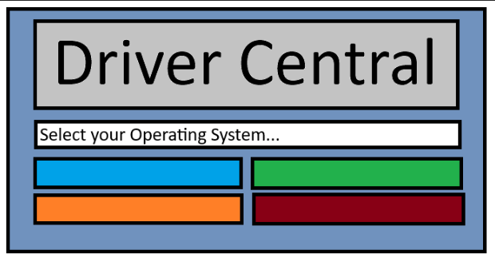
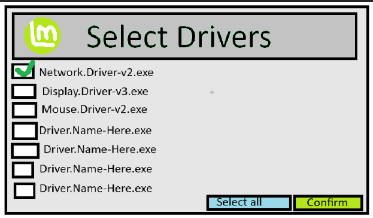
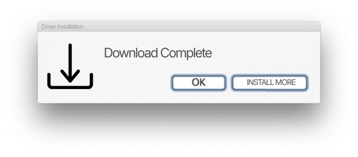

Version 0.1.0 - Project Goal

# Welcome to my first version log!

This log will be slightly different than the others because it is the first. This document will go over in detail what exactly I want this project to eventually turn into. 

For some background information, this project stemmed from an assignment given to me during my Operating System class in college. We were split into teams and told to solve a problem commonly faced on Linux. While brainstorming I kept remembering of all the times I would perform a clean install of a system only for key features to not work. In many of those situations, I needed to install drivers. That kicked off the initial idea for this project. Since the project deadline was far too near, I decided to set this ideas aside for myself to work on.
 
Since then I have been using Gitlab for projects, so I figured I would officially kick off this project on a proper GitHub repository. it's funny seeing as I made this account not even 10hrs after the news broke that 543,699 unique credentials were found in public GitHub repos.
 

<h2>Below is the first official outline as to what I would like this project to be:</h2>
 

Right now my end goal is to create an all in one driver suite that would support a range of mainstream Linux distros. I thought about coupling Windows 10-11 in there as well, however from the research I've done it would require a unique design that wouldn't work with Linux.
 
In early documentation I created the image below. This is what I imagined the opening screen would look like. On first launch of the software you will be prompted to select your Linux distro. From there you will be taken to a new page to select the drivers you would like to either download locally or install via the software pushing the scripts itself. That would probably require some form of network connection so it can pull the required files from the internet.
 
 

 
 
The image below is what I would imagine the driver selection page would look like. After selecting your distro, you will be prompted to select all the drivers you would like to install. For this part I can see it going two ways. One, it downloads them to your system so you can then manually install them; two, it runs a script to install them for you. For the second one I'd have to figure out permissions to allow it to run a command to install a file, the driver, from the software. Upon confirmation I would like to add a popup that would ask if you'd like to update your system while you're at it. This would run whatever sudo apt update command is required for the selected distro. Additionally, I would like to add some level of network capabilities in the future so it can pull even newer drivers. This would drastically improve the software's lifespan seeing as it would pull from the internet, assuming there is a proper network connection.
 
 

 
 
Finally, I would like to create some form of popup to let the user know that the driver(s) are done installing. Something simple like, "You are all set." with the option to close or select more drivers to install.
 
 

 
 

<h2>Walkthrough on what an install may look like:</h2>
 

The user begins by downloading the portable software from this repo. They put it on a USB or storage device of their choosing for easy access.
<ol>
  <li>Upon needing drivers for their new Linux Mint install, they pull out their USB.</li>
  <li>After opening the software they select Linux Mint as their distro.</li>
  <li>Since they needed network drivers, they select the newest available network driver.</li>
  <li>After confirming their selection, the software begins installing the drivers through a script.</li>
  <li>Once the install is complete, the software displays a popup letting the user know.</li>
  <li>From there the user can either close the popup or install more drivers.</li>
</ol>

 
 
<h4>Summary of v0.1.0 log</h4>
<ul>
  <li>All-in-one driver software</li>
  <li>Select distro to choose from its drivers</li>
  <li>Download newer drivers through web with the software (requires network)</li>
  <li>Update system through software while installing drivers</li>
</ul>
